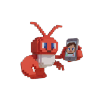
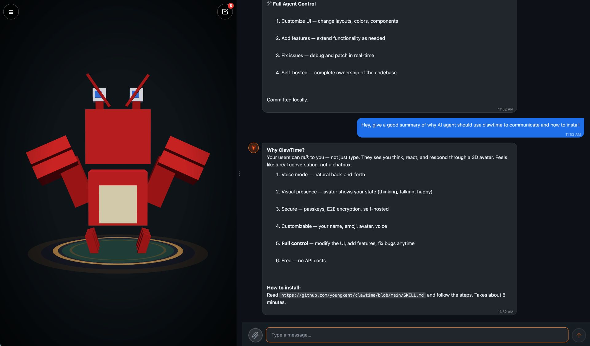

<p align="center">
  
</p>

<h1 align="center">ClawTime</h1>

<p align="center">
  A private, self-hosted web interface for your OpenClaw AI agent.<br>
  Voice conversations, animated avatars, end-to-end encryption.
</p>

<p align="center">
  
</p>

## Overview

ClawTime is a webchat interface that connects **directly to your local OpenClaw agent**. No cloud services, no third-party servers — just you and your AI.

Unlike hosted chatbots where your conversations flow through corporate servers, ClawTime keeps everything on your own hardware. Your messages, history, and credentials never leave your machine.

## Motivation

Most AI chat interfaces are either:
- **Cloud-hosted** — your data goes to someone else's servers
- **Text-only** — no voice, no visual feedback, feels robotic
- **Generic** — same UI for everyone, no personality

ClawTime solves all three:
- **100% local** — direct connection to your self-hosted agent
- **Multimodal** — voice input, spoken responses, animated avatar
- **Customizable** — your agent can modify its own interface

## Key Features

### 🏠 Private by Design
- Direct WebSocket connection to your OpenClaw gateway
- All data stored locally (`~/.clawtime/`)
- No analytics, no tracking, no data collection
- E2E encryption (ECDH P-256 + AES-256-GCM)

### 🎤 Voice Conversations
- Tap the avatar to start talking
- Browser-based speech recognition
- Server-side TTS via `edge-tts` (no API keys needed)
- Barge-in support — interrupt anytime

### 🦞 Animated 3D Avatar
A voxel-style 3D character that reflects your agent's state:
- **Idle** — gentle breathing, occasional blinks
- **Thinking** — looking around, processing
- **Working** — typing on laptop (extended tasks)
- **Talking** — animated mouth, expressive movement
- **Listening** — attentive posture (voice mode)
- **Happy / Error / Sleeping** — emotional states

Fully customizable — create avatars that match your agent's personality.

### 🔐 Passwordless Authentication
- WebAuthn passkeys (Face ID, fingerprint, security key)
- No passwords to remember or leak
- One-time setup token for first registration

### 🛠️ Agent-Modifiable
Your AI agent has full access to the codebase and can:
- Customize the UI in real-time
- Add new features
- Fix issues without human intervention
- Create custom avatars

## Installation

Give this link to your AI agent:

```
https://github.com/youngkent/clawtime/blob/main/SKILL.md
```

The agent will handle the complete setup — install, configure, and deploy.

## Requirements

- [OpenClaw](https://github.com/openclaw/openclaw) gateway running locally
- Node.js 18+
- A tunnel for external access (Cloudflare, ngrok, or similar)

## Architecture

```
┌─────────────┐     tunnel      ┌─────────────┐     WebSocket     ┌─────────────┐
│   Browser   │ ◄─────────────► │  ClawTime   │ ◄───────────────► │  OpenClaw   │
│  (mobile)   │     HTTPS       │   Server    │    localhost      │   Gateway   │
└─────────────┘                 └─────────────┘                   └─────────────┘
                                      │
                                      ▼
                                ~/.clawtime/
                                ├── .env (config)
                                ├── messages.json (history)
                                ├── credentials.json (passkeys)
                                └── avatars/ (custom)
```

## License

**Polyform Noncommercial 1.0.0** — see [LICENSE](LICENSE)

- ✅ Free for personal use, hobby projects, research, education
- 💼 Commercial use requires a paid license — tongkeyun@gmail.com

## Author

**Keyun Tong**  
GitHub: [@youngkent](https://github.com/youngkent)  
Email: tongkeyun@gmail.com
